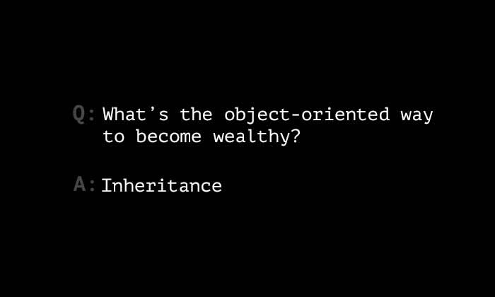
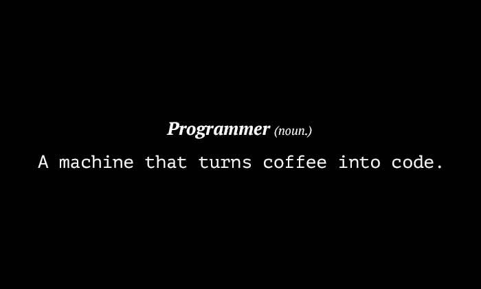
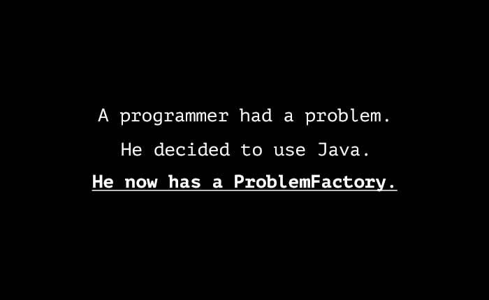

# awesome-jokes

  
     
     
     
     
     
     
     
    <h3>
    <em>Collection of</em><code> Awesome Jokes! 😆 </code>
    </h3>
     
     
     
     
     
     
     
  

---

  
     
     
     
     
     
     
    <h3>
    <em>Feel free to create a </em> <code> pull request ❤️</code>
    </h3>
     
     
     
     
     
     
  

️