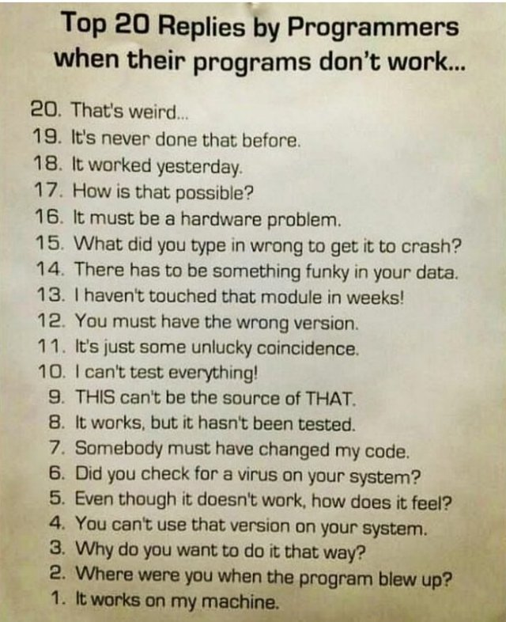
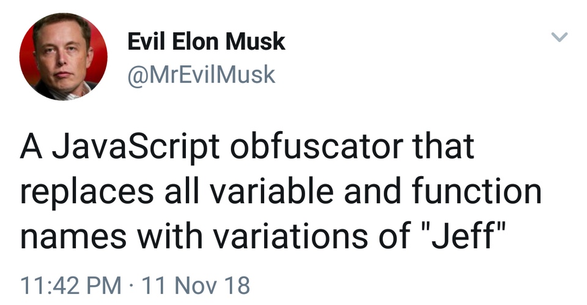
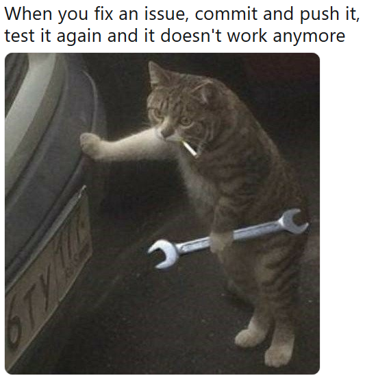
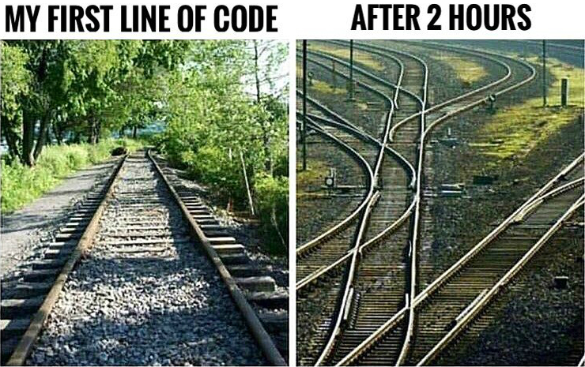
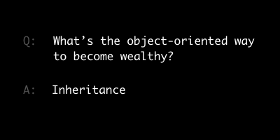
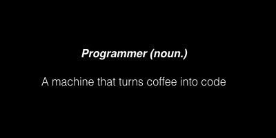
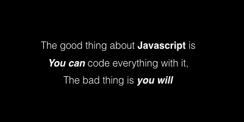

  
     
     
     
     
     
     
     
    <h3>
    <em>Collection of<code> Awesome Jokes! </code></em> 😆
    </h3>
     
     
     
     
     
     
     
  

 
 
 

  

 
 

  

 
 

  

 
 

  

 
 

  

 
 

  

 
 

  

 
 

  

 
 

  

 
 

  

 
 
 

---

  
     
     
     
     
     
     
    <h3>
    <em>Feel free to create a<code> pull request </code></em> ❤️
    </h3>
     
     
     
     
     
     
  

